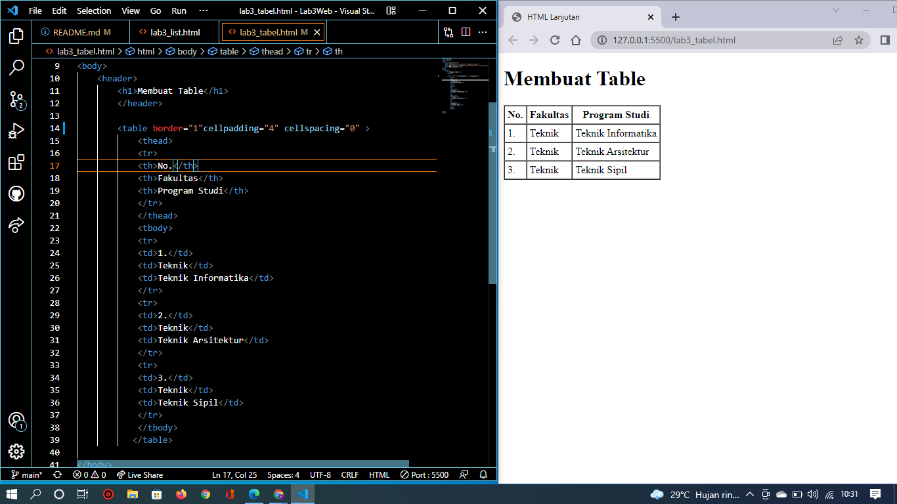

# Lab3Web
## Nama : Prananda Aditya
## NIM : 312010130
## Kelas : TI.20.A1
## Matkul : Pemograman Web

# Langkah-Langkah Praktikum Membuat list
## 1. Persiapan membuat dokumen HTML dengan nama file lab3_list.html seperti berikut.

## 2. Membuat Ordered List
 Kemudian tambahkan kode untuk membuat Ordered List seperti gambar berikut.

## 3. Membuat Unorderd List
 Kemudian tambakan kode untuk membuat Unordered List, setelah deklarasi ordered list pada 
section unordered-list, seperti berikut.

## 4. Membuat Description List
 Kemudian tambahkan kode untuk membuat description list setelah deklarasi unorderd-list. Seperti Gambar berikut :

# Langkah-langkah Praktikum Membuat Tabel
 Buat file baru dengan nama lab3_tabel.html seperti berikut.

 Kemudian selanjutnya tambahkan kode untuk membuat tabel sederhana seperti berikut:

## Mengatur Margin dan Padding
 Untuk mengatur margin dan padding pada cel data, tambahkan atribut cellpadding dan 
cellspacing pada tag table.

## Menggabungkan Sel Data
  Untuk menggabungkan sel data, gunakan atribut rowspan dan colspan. Atribut rowspan untuk 
menggabungkan baris (secara vertikal) dan colspan untuk menggabungkan kolom (secara 
horizontal).

# Langkah-langkah Praktikum Membuat Form
 Buat file baru dengan nama lab3_form.html seperti berikut.

 Kemudian selanjutnya tambahkan kode untuk membuat tabel sederhana seperti berikut:

## Menabahkan Style pada Form
 Agar tampilan form lebih menarik, bisa ditambahkan CSS seperti berikut :

## Pertanyaan dan Tugas
 1. Buatlah form yang menampilkan dropdown menu dan listbox dengan multiple selection.
# Disini saya membuat form pengisian KRS Mahasiswa
 form hasil

 HTML

 CSS

